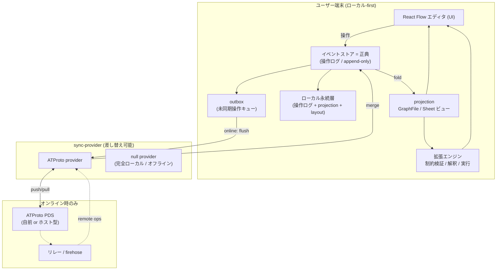
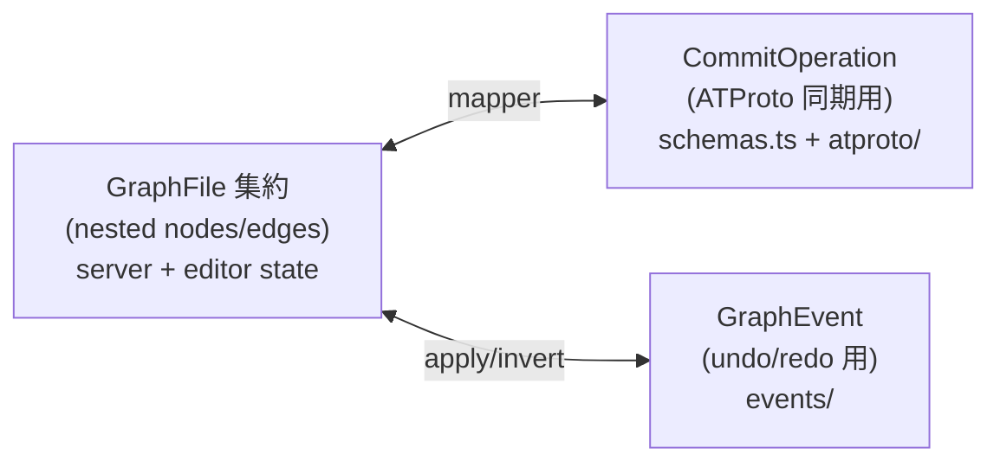
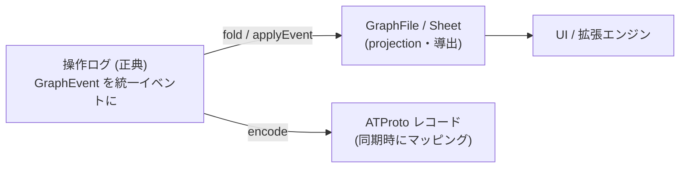

# step1 アーキテクチャ (draft)

> ステータス: **ドラフト** / 作成日: 2026-07-11
> 位置づけ: step0 (Web/シングルユーザー/ファイル保存) の次段。試験リリース後の方針検討 ([interim report](../reports/interim_2026-07-07.md)) と、それに続く設計相談の結論をまとめる。
> このドキュメントは「コードの仕切り直し」ではなく「**仕様の仕切り直し**」を記述する。既存資産 (React Flow エディタ, Zod スキーマ, イベントソーシング, ATProto レコードモデル, テスト群) は継続利用する。

---

## 1. 背景と、確定した方針

interim report で挙げた懸念 (ATProto の妥当性 / フロントエンド偏重 / 拡張容易性 / オフライン) を検討した結果、以下を確定した。

| # | 論点 | 決定 | 根拠 |
|---|---|---|---|
| D1 | 配布形態 | **ローカル-first (各自の端末で動く)** を正式方針とする (当初の Tauri 方針への回帰) | オフライン・疎な同期・フェデレーション・拡張計算の置き場が、すべてこの1点に収束する (§2) |
| D2 | 同期の密度 | **疎な同期で十分**。密なリアルタイム CRDT (Figma/Google Workspace 型) は当面追わない | ユーザー確認。低速・低帯域前提。ただしロック/手動 polling は避ける |
| D3 | 分散基盤 | **ATProto を継続**。ただし「sync-provider の1実装」に格下げする | フェデレーションは北極星として温存。MST/OR-Set は疎な追記同期に好適。Meteor は「要らないリアルタイムを買い、要る分散を捨てる」誤トレード |
| D4 | 正典データモデル | **操作ログ (イベント) を source of truth**にし、`GraphFile`/`Sheet` 集約はそこからの projection とする | 二重モデルの解消。ローカル-first・疎同期・コンフリクト可視化・拡張機能のすべてに直結 |
| D5 | 計算の場所 | **ユーザー端末 (ローカル)**。中央サーバに恒常的な計算を置かない | D1 の帰結。制約検証・解釈・実行はローカルで走る |
| D6 | VPS の役割 | アプリ配信からは降ろす。**オプションのホスト型 PDS / リレー**に用途変更 | D1 では各自ローカルで動くため、アプリを配る VPS は不要 |

### 経緯メモ

- 本プロジェクトは当初 **Tauri ベース**で開始したが、**ARM64 / Rosetta の問題**でうまく動かず、「まずグラフエディタが作れることを確認する」ため Tauri を後回しにして **Web 構成でリポジトリを作り直した**。step0〜現在の Web 実装はこの経緯によるもの。
- step1 は、エディタが実証できた今、当初方針 (D1) に戻す段階と位置づける。

---

## 2. なぜ B (ローカル-first) が中心なのか

バラバラに見えた要件が、B では**単一のアーキテクチャで一度に**満たされる。ここが step1 の背骨である。

| 要件 | B での満たされ方 |
|---|---|
| オフライン編集 | データが自分のディスクにある → **原理的に常にオフラインで編集可能**。後付け機能ではなく設計の性質 |
| 疎な同期 (D2) | ローカルが正典。ATProto PDS は**オンライン時に flush する同期先**。ロックも手動 polling も不要 |
| フェデレーション (北極星) | **各自が自分のノードを持つ = 「小集団が相互作用する」ビジョンそのもの** |
| 拡張計算 (D5) | 制約検証・解釈・実行が**ユーザー端末で走る**。中央サーバ不要 |

> step0 で感じた「フロントエンド偏重」は、**A (Web) を前提にしたときだけの問題**だった。B では計算がローカルにあるのが正しく、偏重は問題ではなく正解になる。

---

## 3. 全体アーキテクチャ



### レイヤーの責務

| レイヤー | 責務 | 現行コードとの対応 |
|---|---|---|
| UI | React Flow による編集・表示 | `GraphEditor.tsx`, `graphTransform.ts` ほか (**継続**) |
| イベントストア (正典) | 操作を append-only に記録。undo/redo。fold で状態を導出 | `events/GraphEvent.ts`, `applyEvent.ts`, `invertEvent.ts`, `hooks/useEventStore.ts` (**昇格**) |
| projection | 操作ログ → `GraphFile`/`Sheet` を導出。UI と拡張エンジンが読む | 新規 (集約は「保存形式」から「導出ビュー」へ) |
| ローカル永続層 | 操作ログ・projection・layout をディスクに保存 | 現 `src/server` (Hono) を**再パッケージ**して同梱 (§5) |
| outbox | 未同期操作を保持し、オンライン時に flush | 新規 |
| sync-provider | 同期の抽象境界。ATProto は1実装 | 現 `src/client/src/atproto/*` を provider 実装に整理 (§6) |
| 拡張エンジン | ローカルで制約・解釈・実行 | 新規 (step2 以降、§8) |

---

## 4. データモデル: 操作ログを正典に一本化 (D4)

### 現状: 三重表現になっている

今、同じグラフが**3つの表現**で並走している。これが最大の複雑さの源。



### 目標: イベントを正典、集約は projection



- **`GraphEvent` と `CommitOperation` を1つのイベント語彙に統合する。** 両者は既にほぼ同型 (`node.add/update/remove`, `edge.add/update/remove` ↔ structure/content イベント)。二重定義を解消する。
- `GraphFile`/`Sheet`/`ConversensusFile` スキーマは**破棄しない**。役割を「保存の正典」から「**projection ビュー / エクスポート形式 / インポート受け口**」に変える。エディタ・PNG エクスポート・`.conversensus` 入出力はこの projection を使い続ける。
- **layout は per-user・ローカル限定**とする (category=`layout`/`presentation` のイベント)。同期対象はセマンティック (structure/content) に限定し、コンフリクト発生源をセマンティック変更に絞る (atproto-integration-strategy の方針を踏襲)。

### イベントの最小要件 (同期・マージのため)

疎な同期とコンフリクト可視化を成立させるため、各イベントに以下を持たせる:

| フィールド | 用途 |
|---|---|
| `id` | イベント一意識別 (べき等な適用・重複排除) |
| `actor` (DID or `local`) | 誰の操作か。現 `LOCAL_USER_ID='local'` を DID に接続 |
| `target` (nodeId/edgeId) | OR-Set / LWW の解決単位 |
| `category` | structure=同期 / layout・presentation=ローカル限定 の振り分け |
| `timestamp` / 論理時刻 | LWW と可視化の順序付け |

### マージ方針 (疎な同期)

- **add / delete**: ATProto MST の OR-Set に委ねる (コンフリクトフリー)。
- **同一エンティティへの並行 content 変更**: LWW で暫定確定しつつ、**「対立」としてグラフ上に可視化**する (conversensus の主題: コンフリクト = 合意形成の機会)。密な自動マージ (CRDT) は D2 により当面追わない。

---

## 5. ローカル永続層: 現行サーバの再パッケージ (作り直しではない)

- 現 `src/server` (Hono + `data/*.json`) は、開発時すでに **localhost で動くローカル永続デーモン**として機能している。B ではこれを **VPS デプロイの代わりに端末へ同梱**する。役割 (ローカル永続) は不変。
- 保存対象を「`GraphFile` 丸ごと PUT」から「**操作ログ (append) + projection スナップショット + layout**」へ移行する (D4)。
- ストレージ実体の候補 (未決 O1):

| 選択肢 | 長所 | 短所 |
|---|---|---|
| JSON ファイル (現行踏襲) | 実装最小・可搬・人間可読 | 大きな操作ログで非効率 |
| SQLite | 追記ログ・範囲取得・将来のクエリに強い | 依存追加 |
| ブラウザ IndexedDB | 軽量 B (デーモン+ブラウザ) 時にサーバ不要 | 端末ローカルサーバ構成と二択 |

---

## 6. 同期: sync-provider の境界 (D3)

ATProto を全体に load-bearing させない。**単一のインターフェース**の裏に隠し、`null`(完全ローカル)/ ATProto を差し替え可能にする。

```
interface SyncProvider {
  push(ops: GraphEvent[]): Promise<void>   // outbox flush
  pull(since: Cursor): Promise<GraphEvent[]> // remote 変更取得
  subscribe(onRemote): Unsubscribe          // firehose/jetstream (polling 卒業)
}
```

- 現 `atproto/{collections,sync,mapper,branchState,poller}.ts` を、この provider の**内部実装**として整理する。外の層は provider インターフェースだけに依存する。
- **オフライン時**: provider 呼び出しをスキップし、操作は outbox に積む。復帰時に flush。UI は常にローカル正典を読むので**編集は途切れない**。
- **要改修 (現行の構造問題)**:
  - **全件 list の解消**: `fetchSheetsFromAtproto` の「node/edge 全件取得 → JS で filter」は破綻する。rkey プレフィックス / コレクション分割で範囲取得へ。
  - **手動 polling の卒業**: `poller.ts` を Jetstream/firehose 購読へ (D2: 疎だが手動 polling は避ける)。
  - **`cidCache` の永続化**: 現在メモリ上の Map でリロード消失。ローカル永続層に載せる or 再導出可能にする。

---

## 7. 配布形態: Tauri 再挑戦 vs 軽量 B (未決 O2)

当初 Tauri を止めた原因は **ARM64 / Rosetta 問題**。B に本腰を入れる前に、この原因を**再現・特定してから**選ぶ。

| 案 | 内容 | 長所 | 短所 / リスク |
|---|---|---|---|
| **B1: Tauri v2** | ネイティブ webview に同梱 | 単一バイナリ配布・OS 統合・小サイズ | **過去に失敗した ARM64/Rosetta を再度踏むリスク**。webview 上の React Flow 検証が要る |
| **B2: 軽量 B** | ローカル Hono デーモン + OS 標準ブラウザ | 現構成に**最短**。webview リスク回避。すぐ local-first を実証できる | 単一バイナリではない・起動体験が一段劣る |

> 推奨の進め方: **まず B2 で local-first (オフライン + outbox 同期) を成立させ、価値を確認**。その後、ARM64/Rosetta の根本原因を潰した上で B1 (Tauri) で包む。Tauri 依存を最初のクリティカルパスに置かない。

---

## 8. 拡張機能の土台 (step2 以降の布石)

interim report (4) の拡張群は、正典が操作ログ + projection になっていることで自然に乗る。**step1 では実装せず、乗り口だけ確保する。**

| 拡張 | 乗り方 |
|---|---|
| ラベル/プロパティのテンプレート・制約 | projection に対する検証関数 (ローカル計算) |
| 表示ルール (種別・値ごとの見た目) | projection → view の変換層 |
| 接続制約 | イベント適用時のバリデーション (ローカル) |
| グラフ種別間の変換 | projection 間の変換 |
| 解釈・実行 | 操作ログ / projection を入力とするローカルエンジン |

---

## 9. 移行計画 (順序)

コードは連続、仕様を仕切り直す。**大きなビッグバン書き換えを避け**、以下の順で段階移行する。

1. **正典の一本化 (D4)**: `GraphEvent` と `CommitOperation` を統一イベント語彙へ。集約を projection として導出する経路を作る。テストは既存の `applyEvent`/`invertEvent` 群を土台に拡張。
2. **ローカル永続層 (D1/§5)**: 保存を「操作ログ + projection」へ。ストレージ実体を決定 (O1)。
3. **sync-provider 境界 (D3/§6)**: ATProto を provider 実装に整理。outbox + オフライン分岐を導入。全件 list / polling / cidCache を改修。
4. **配布形態の実証 (O2/§7)**: B2 (軽量 B) で local-first を end-to-end 検証。ARM64/Rosetta 原因調査を並行。
5. **VPS 役割変更 (D6)**: アプリ配信ワークフローを、オプションのホスト型 PDS/リレー用途に読み替え。
6. (step2) 拡張エンジンの着手 (§8)。

---

## 10. 未決事項 (O) とリスク

| ID | 未決 / リスク | 備考 |
|---|---|---|
| O1 | ローカルストレージ実体 (JSON / SQLite / IndexedDB) | §5。配布形態 O2 と連動 |
| O2 | Tauri (B1) か 軽量 B (B2) か | §7。ARM64/Rosetta 原因特定が前提 |
| O3 | branch/commit/merge 機能を統一イベントモデルにどう載せ替えるか | 既存 `branchState.ts` (969行) の扱い。projection のブランチ = 操作ログの分岐として再定義できるか要検討 |
| R1 | ARM64/Rosetta の再燃 (Tauri) | 着手前に最小再現で切り分け |
| R2 | 移行中の二重モデル併存期間 | 段階移行ゆえ一時的に §4 の旧新が共存する。期限を切る |
| R3 | ATProto 範囲取得の設計 | 全件 list をやめる rkey/コレクション設計 (§6) が同期性能を左右 |

---

## 11. step0 からの差分 (要約)

| 観点 | step0 | step1 |
|---|---|---|
| 配布 | Web (VPS 配信) | ローカル-first (端末で動作) |
| 正典 | `GraphFile` 集約 (丸ごと保存) | 操作ログ (イベント)、集約は projection |
| 保存先 | サーバのディスク (リモート) | 端末ローカル |
| オフライン | 実質不可 (Web 配信時) | 原理的に常時可 |
| 同期 | ATProto 直叩き (ブラウザ) | sync-provider 経由・outbox flush・疎な同期 |
| 計算 | ブラウザ | ローカル (拡張はローカルエンジン) |
| VPS | アプリ配信 | オプションの PDS/リレー |
