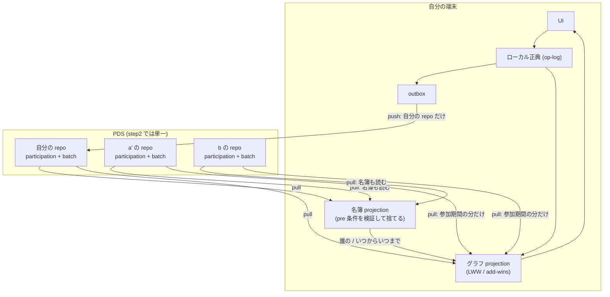

# step2 アーキテクチャ

> ステータス: **草案 (レビュー待ち)** / 作成日: 2026-08-30
> 位置づけ: [step1 アーキテクチャ](./step1.md) からの**差分**を記述する。
> 入力は [step2 要件仕様](../requirements/spec-step2.md) と `../requirements/spec/` 配下、
> 出力は [step2 実装計画](../plans/step2-implementation.md) の Phase 分割である。
>
> **この文書が扱うのはフェーズを横断する判断だけ**である。あるフェーズの中で閉じる設計は
> `plans/step2-phase<N>-*.md` に書く。ここに書くのは「あるフェーズで決めて、別のフェーズが
> 支払う」ものに限る。

## 0. step1 アーキテクチャは何を見込んでいたか

step1 の §8 は step2 を「**拡張エンジン**」と見込んでいた。実際の step2 は
[要件仕様](../requirements/spec-step2.md) のとおり「**共同作業できるようにすること**」である。

見込みが外れたわけではなく、**順序が入れ替わった**。step1 §8 が挙げた拡張群のうち
step2 で作るのは template ひとつだけで、それも toulmin model の直書き 1 本に絞ってある。
残りは step3 以降に残る。共同作業を先に置いたのは、conversensus の主題が
**コンフリクト = 合意形成の機会**であり、そこに到達するには複数の actor が同じグラフを
触っている状態が要るからである。

したがって step1 §8 の「乗り口だけ確保する」という約束は生きている。template は
§8 の表にある「projection に対する検証関数」の枠にそのまま入る。

---

## 1. 変わらないもの

step1 で確定し、step2 でも動かさないもの。**下の §2 以降を読むときの土台**である。

| | 内容 |
| --- | --- |
| 正典 | **操作ログ (op-log)**。集約 (`GraphFile` / `Sheet`) は projection であって保存形式ではない |
| ローカル-first | UI は常にローカル正典を読む。オフラインでも編集は途切れない |
| outbox | 未同期の操作を保持し、オンライン時に flush する |
| sync-provider の境界 | 同期は単一のインターフェースの裏に隠す。ATProto は 1 実装にすぎない |
| presentation | 同期しない (per-user・ローカル限定)。決定論的に再導出できるため |
| 全順序 | `orderBatches` の `(clock, actor, batchId)`。**actor をまたいでも決定論的**である |

最後の 1 行が step2 の前提として大きい。多アクタの畳み込みで新たに決めることが無い。

---

## 2. 多アクタの読み取りモデル

**step2 で最も大きい構造の変化はここである。**

step1 の同期は自分の repo に閉じていた。`atproto/collections.ts` の
`listRecords` / `getRecord` / `putRecord` は 5 箇所すべてが `repo: currentDid()` である。

step2 では**書くのは自分の repo だけ、読むのは N 人の repo** になる。

読む対象は正確には「参加者全員」ではない。**名簿に載っている actor と、参加コードが指す
招待者**である。被招待者は「本当に自分が招待されたか」を招待者の repo で確かめる必要があるが、
その時点でまだ参加者ではない ([participation](../requirements/spec/participation.md)「名簿の置き場」)。
つまり **repo を読む資格は、名簿への所属とは独立**している。

この非対称 (**write = 1、read = N**) から次が導かれる。

- **`SyncProvider` が表すのは「1 つの repo」ではなく「この File の同期」である。**
  現行の `FanoutSyncProvider` は既に local と remote の 2 系統を 1 つの provider の顔で
  束ねているので、remote 側を N repo へ広げるのは同じ形の延長になる。
  provider インターフェース (`push` / `pull`) は変えない
- **cursor は DID ごとに持つ。** 範囲取得 (step1 Phase 7) は repo 単位に rkey を seek する
  仕組みなので、参加者ごとに独立した cursor が要る。**`Cursor` は不透明トークン
  (`type Cursor = string`) なので、DID ごとの cursor をそのまま詰められる** — これが
  provider インターフェースを変えずに済む理由である
- **`repo` を引数として引き回す層が要る。** `collections.ts` を開くのは Phase 0 の仕事だが、
  「誰の repo か」を決めるのは名簿であり、名簿は Phase 1 にある。したがって
  **Phase 0 では口を開けるだけで、呼び出し側は変えない**
- **波及は「広く浅く」ではなく「深く狭い」。** `collections.ts` を import するのは
  `atproto/index.ts` だけで、その API を叩くのは実質 `atprotoSyncProvider.ts` の 4 箇所である。
  `rangeFetch` は既に `ListRecordsPage` を**注入で受け取る**形をしている。
  **repo 引数を通す継ぎ目は既に空いている**

### 読む順序は名簿 → グラフに固定される

参加していた期間の op-log だけを同期すると決めた以上、**グラフを取りに行く前に名簿が
確定していなければならない**。これは実装の都合ではなく、意味論から出てくる順序である。

同期の 1 サイクルは次の形になる。

1. **名簿に載っている全 actor の** repo の participation を読み、名簿を projection する
2. 名簿から「いま参加している actor」と「各 actor の参加期間」を得る
3. 各 actor の repo の batch を、その期間の分だけ読む
4. 全員分を 1 つのグラフ projection に畳む (= implicit merge)

**手順 1 が「自分の repo」で済まないことに注意する。**書くのは自分の repo だけなので、
「a が a' を招待した」op は **a の repo** にある。b がその招待を知る道は a の participation を
読むこと以外に無い。仕様が「被招待者は**招待者の repo で**確かめたい」と書いているのも同じ
事情である ([participation](../requirements/spec/participation.md)「名簿の置き場」)。

### 名簿の読み出しは不動点計算になる

手順 1 には**循環がある**。誰の participation を読むかは名簿が決めるが、その名簿は読んだ
結果で決まる。素朴に書くと「既知の参加者の participation を読む → 名簿が更新される →
新たに載った actor の participation を読む → …」と回り続ける。

**既定は 1 パスとする。**名簿の食い違いは正常な状態であり、収束を待つ必要が無いからである。
1 パスで止めれば「1 ホップ先の招待までは見えるが、その先はまだ見えない」状態になるが、
それは「まだ同期していない」と同じことで、次のサイクルで追いつく。

ただし**これは費用の選択でもある**。収束まで回せば「知らなかった」状態は起きにくくなる
代わりに、同期 1 回のラウンドトリップ数が**名簿の深さに比例**する。step2 は単一 PDS +
招待制で名簿が浅いので 1 パスで足りると見ている。**Phase 1 の設計で 1 パスに確定した**
(→ [step2-phase1-participation](../plans/step2-phase1-participation.md) §6)。

読み出しの**起点**は 2 つある。

- 既に参加している actor: 自分自身。そこから名簿を辿る
- **まだ参加していない被招待者**: 名簿に自分がいないので辿れない。**参加コードが指す招待者の
  DID** が起点になる。仕様が参加コードに招待者 DID を含めているのはこのためである

**⚠️ 被招待者の起点だけは 1 パスでは足りない** (2026-09-05 実機で発覚)。参加した人は誰でも
招待できるので、**招待者が File の起点 (genesis) を書いた人とは限らない**。招待者の repo には
genesis も招待者自身への招待も無いので、そこだけを畳むと名簿が空になり、**その repo にある
招待は残らず `issuerNotParticipating` で捨てられる** — 被招待者には「参加依頼が見つからない」
としか見えない。招待を検めるときは **genesis に届くまで広げる** (`passes: 'converge'`)。
同期サイクルと違って**一度きりの操作**なので、深さに比例するラウンドトリップを払ってよい。

**起点の repo に何があれば名簿が始まるか**は Phase 1 の設計で決めた — 判断ログ側の
`participation.genesis` op である (事実 7 の答え)。グラフ側に `file.create` を足す案は
**判断の畳み込みがグラフの畳み込みに依存する**ため却下した (§4.3 / U6-P2 の一方向性)。

### 名簿の食い違いは正常な状態である

名簿を完全に同期することはできない。a が a' を招待した直後、まだ同期していない b の名簿に
a' はいない。**これは異常ではなく、b が「a' の参加を知らなかった」だけ**である。
b の projection には、同期するまで a' の操作が現れない。

「全員の名簿が一致していること」を不変条件にしてはならない。不変条件は
「**同じ名簿を入力にすれば、誰の手元でも同じグラフになる**」の方である。

---

## 3. projection は 2 段になる

step1 の projection は 1 種類だった (`projectBatches`: op を clock 順に畳む)。
step2 では**畳み込みの意味論が違う 2 つ**が並ぶ。

| | 名簿 projection | グラフ projection |
| --- | --- | --- |
| 入力 | participation collection | batch collection |
| 解決 | **pre 条件を検証し、満たさない op を捨てる** | LWW / add-wins |
| 「無効な op」 | ある | **ない** |
| 更新頻度 | 滅多に変わらない | 常時変わる |
| 期間外 | 履歴として残す | 同期対象から外れる |

**この 2 つを同じ畳み込み器に混ぜてはならない。**混ぜると projection が op の種類で分岐し、
「無効な op を捨てる」という名簿の中核が、グラフ側の「op はすべて有効」という前提と
同居することになる。collection を分けたのはこの帰結であって、逆ではない。

**ただし pre 条件には初期値が要り、それを導出する手段が現状ゼロである。**「file を作った actor が
自動的に参加する」を成立させたいが、`file.create` op は無く、genesis batch の actor は
`GENESIS_ACTOR` という固定文字列なので、**作成者の DID が op-log のどこにも載っていない**。
最初の 1 人が決まらないと最初の招待が pre 条件で落ちる。**名簿の起点は導出できないので、
明示的な op で置く**しかない (Phase 1 の宿題)。

pre 条件の検証が名簿の中核なのは、そこから 2 つの性質が同時に出るからである。

- **招待されていない actor の承認は無効**になる。参加コードは秘密ではない (被招待者の DID を
  含むだけ) が、本人以外の承認は projection の段階で落ちる
- **取り消し合いが起きても、誰の手元でも同じ結論**になる。a が a' を取り消した後、それを
  知らない a' が a を取り消す op を出しても、clock 順では a' は既に名簿にいないので捨てられる

検証しなければ、取り消された側が取り消し返せてしまい、手元によって名簿の結論が変わる。

---

## 4. collection の割り当てと、implicit merge を書かない判断

### 4.1 現状 (step1 完了時点)

**まず現状を正確に押さえる。**ここを取り違えると step2 の工数を大きく読み違える
(実際、本文書の初版が取り違えていた)。

| | 置き場 |
| --- | --- |
| グラフ (trunk の op-log)。**explicit merge の結果もここに入る** — merge は branch batches を trunk 先端の後へ再スタンプして追記する操作なので、追記された batch がそのまま載る | batch collection |
| **branch / commit / merge コミットそれ自体** | **どこにも同期されていない。** `BranchMeta` / `Commit` はローカルデーモンの SQLite (`branches` / `commits` テーブル) の行であり、branch batches は remote へ push しない専用 file_id に貯まる (step1 設計 §9.2 の不変条件)。PDS の `branch` / `commit` / `merge` NSID は step1 Phase 6 p6-5b で消費者ごと退役しており、**参照が 0 件である** |

**この非対称が step2 の出発点である。**「merge の**結果**は共有されるが、merge という
**出来事**も branch も共有されない」— 単一端末では問題にならなかったが、共同作業では
「相手が branch を切って merge しようとしている」ことが相手に見えない。

### 4.2 step2 完了時点の目標

| | 置き場 |
| --- | --- |
| 名簿・**判断** | **participation collection (新設)**。§4.3 参照 |
| グラフ | batch collection (現行) |
| **branch / commit / merge** | **batch collection へ昇格させる** (op-log の一級市民にし、同期する)。§4.1 の非対称を解消しないと DtR も fork も相手に届かない |
| DtR graph (2 つのグラフの中身) | batch collection。trunk の fileId 内に新しい sheet scope を切る |
| implicit merge が作る fork | batch collection (器は branch なので上の昇格に依存する) |
| **fork が持つ「なぜこの fork ができたか」の記述** | batch collection。fork に付随する。**検出時点で凍結する** — §5 |
| **implicit merge そのもの** | **書かない** |

**implicit merge を書かない**のが step2 のデータモデルで最も効く判断である。
implicit merge は冪等な導出なので、結果を書き戻す必要がない。むしろ書くと害がある。

- a が結果を書くと、b がそれを読んでまた畳む。**同じ操作が参加者の数だけ増殖する**
- 「a の op-log には a が意図した操作だけが載っている」という性質が壊れる
- **「参加していた期間の op-log だけを同期する」が意味をなさなくなる。** a のログに b の操作が
  入っていると、期間で切れない

3 番目が決定的である。§2 の読み取りモデルは、各 actor の op-log がその actor 自身の意図
だけを載せていることに依存している。

一方 **DtR graph と fork は書く**。どちらも**人間が下した判断**であって導出ではない。
同じ入力から自動的には再現できないので、記録しなければ失われる。fork を書かないと、
ユーザが解決したはずの fork が同期のたびに復活する。

**ただし fork については、この理由づけは正確ではない。**DtR graph は人間が下した判断だが、
fork が**作られること自体は自動**である (判断が要るのはその後の解決の方である)。書くのは、
解決という判断が取り消す対象を必要とするからにすぎない。そして implicit merge は全参加者が
それぞれの手元で行う導出なので、**同じ競合を全員が独立に検出する** — 素直に作ると、一つの
競合に対して参加者の数だけ fork ができる。**導出したものを書く以上、同一性も導出できなければ
ならない** (→ 計画 §5.5 の **S4。未決**)。

### 4.3 この割り当てが崩れる経路は 2 つある

**初版はこれを 1 つ (U6: DtR が branch モデルに乗るか) だと書いていたが、問いの立て方が
ずれていた。**危ないのは 2 番目である。

1. **DtR のグラフ本体の置き場。** これは trunk の fileId 内に**新しい sheet scope を切る**ことで
   batch collection に乗る。`projectFile` は live でない sheetId の content batch を無視する
   ので、DtR の sheet を知らない端末の projection を壊さない。**fileId を新しく切ってはならない** —
   `discoverRemoteFiles` が未知の fileId を新しい File として materialize するので、
   競合のたびに左サイドバーに File が増える
2. **承認の畳み込み意味論。** 承認は「呼び出された actor であること」「その時点で名簿にいること」を
   pre 条件として検証し、満たさないものを**捨てる** op である。**§3 が collection を分けた理由
   そのものが、batch collection の内側で再発する。**

したがって **DtR の承認は判断ログ (= participation collection) 側に置く**。名簿・承認・fork の
紐付けはいずれも「pre 条件を検証して捨てる」畳み込みであり、§3 の 2 分割
(**グラフ = op はすべて有効 / 判断 = 検証して捨てる**) とそのまま一致する。collection は 2 つに
保たれ、読む順序 (判断 → グラフ) も名簿と同じなので同期サイクルも変わらない。

**この決定は Phase 1 で払う。** participation collection を「名簿専用」に狭く切ると、
Phase 6 で 3 つ目の collection が要る。広く切るコストは命名と lexicon の形だけで、
**改名の最後の機会が Phase 1 である**。

なお「1 つの collection に 2 つの意味論」自体には前例がある。file op (`sheet.*` / `file.*`) は
`isFileOp` で routing され、グラフ op とは別の畳み込み器 (`foldFileStructure`) が処理していて、
混ざっていない。したがって承認を batch collection に置く案 (routing で分離する) も
成立はする。判断ログ側を採るのは、**承認をグラフより先に読む必要がある**ためと、
参加期間フィルタをグラフとは別扱いにできるためである。

### 導出コストは払い切りにする

書かないと決めた以上、同期のたびに全参加者のログを畳むことになる。取得は DID ごとの
cursor で減らせるが、**projection は毎回全量**である (計画の U4)。
step2 の規模では問題にならないと見ているが、ここは「速いから選んだ」のではなく
**「正しさのために選び、コストを引き受けた」**ものである。実測して必要になったら
projection のキャッシュを考える — ただしそれは**導出結果のキャッシュ**であって、
op-log への書き戻しではない。

---

## 5. 競合の扱いが step1 から変わる

step1 アーキテクチャ §4「マージ方針」は、次の 2 つを述べていた。**step2 はどちらも改める。**

| step1 の記述 | step2 |
| --- | --- |
| add / delete は ATProto MST の OR-Set に委ねる (コンフリクトフリー) | **structure の競合を検出する。**「片方の操作がもう片方の前提を壊す」非対称な衝突は OR-Set では消えない |
| layout の並行変更は LWW で確定するのみ。**可視化しない** | **検出して通知する。**ただし DtR graph は起動しない |

step1 の記述が誤っていたのではなく、**step1 には共同作業が無かったので問題が現れなかった**。
1 人が複数端末で使う限り、削除依存も layout の取り合いも起きにくい。

step2 の扱いは 3 段になる。

| 種別 | 扱い | 起動 |
| --- | --- | --- |
| content | 対立として検出 | **DtR graph を強制起動** |
| structure | 対立として検出 | 通知し、そこから手動で選択的に起動 |
| layout | 対立として検出 | **通知のみ。**DtR は起動しない |

layout を DtR の対象にしないのは、共同編集中に二人が同じノードを動かすことが日常的に
起きるからである。毎回「対話して決着すべき競合」に上げると DtR がノイズで埋まる。
一方で検出しないと、位置が飛んだ理由がユーザに分からない。**通知だけがその中間**である。

### レイヤーの割り当て

| 責務 | どこ |
| --- | --- |
| **explicit merge** の競合検出 | `shared/src/events/merge.ts` (ドメイン)。content + structure は実装済 (#206/#207/#208)、layout が残る |
| **implicit merge** の競合検出 | **置き場が無い (新規)。**下記 |
| 決着までの**既定の振舞い** (add-wins) | `shared/src/events/project.ts` (projection)。**node/edge には未実装** (下記) |
| **通知**と DtR の起動 | UI |

**implicit merge の検出先が現状ゼロである。** `mergeBranches(trunkAfterBase, branchBatches)` は
explicit merge 専用で、非テストの呼び出しは `mergeBranch.ts` の 1 箇所しかない。受信経路は
`orderBatches` + `projectFile` で畳み直すだけなので、**`merge.ts` を一度も通らない**。

これは見落としやすい穴である。layout を競合として扱うと決めた根拠 (「共同編集中に二人が
同じノードを動かすことは日常的に起きる」) は、そもそも **implicit merge の状況**を指している。
explicit merge だけに検出器を持っていても、その状況は捕まらない。

implicit merge の検出は「畳み込みの途中で、同じ単位に異なる値が並んだこと」を見るしかない。
projection の内側に置くか、projection の前段で batch 列を突き合わせるかは Phase 3 の設計事項である。

**この検出器は競合を見つけるだけでなく、その場で「なぜ競合したか」を凍結して出さなければ
ならない。**fork には explicit merge のような紐づく merge 操作がないので、検出の瞬間を逃すと
理由を指す先がどこにも無くなる。しかも畳み直しでは復元できない — fork の後も op-log は伸びるし、
負けた側がその後に消えていれば競合そのものが再現しなくなる (→ `merging.md`
「fork に競合の原因を記述する」)。**検出器の出力は `MergeConflict` ではなく
「`MergeConflict` + 人間に見える形 + 分岐点」である。**

材料はほぼ揃っている。`MergeConflict` は `target` / `propertyName` と、両側の
`ConflictSide { batchId, op }` を持つ。`batchId` から `Batch.actor` と clock が引けるので、
**「誰と誰が、いつ」は新しいデータを足さずに導ける** (S1 で決めた「競合に関わった actor の
表示」と同じ導出である)。足りないのは **id を人間に読める形にする分**だけで、
これは凍結する側の仕事である (後から引くと、その要素はもう無いかもしれない)。

**add-wins が projection 側なのが要点**である。決着するまでの間もグラフは表示できなければ
ならず、clock-LWW のままだと削除が後に来た場合に DtR で議論する前に対象が消える。
「判断を保留するなら、情報を消さない方に倒す」— ネガティブ・ケイパビリティの方針が
データモデルに現れる箇所である。

**add-wins という規則自体は既にこの projection の中にある。** `sheet.create` / `sheet.remove`
は add-wins で畳まれており (`project.ts`)、`file.remove` を remove-wins にしたときも
「シートは add-wins だがファイルは違う」と非対称を明示して決めている。
つまり step2 で要るのは**新しい概念の導入ではなく、既にある規則を node/edge へ広げること**である。

広げる先が問題を含んでいる。**`node.remove` は現在、子孫をカスケード削除する。**
親の居ないノードを残さないための不変条件としてそうしてあるのだが、add-wins から見ると
**削除の効果が最も広く及ぶ形**になっている。「削除を保留する」と決めたとき、カスケードの
どこまでを保留するのかは自明ではない — 親だけ残すのか、子孫ごと残すのか。
ここは Phase 3 の設計で明示的に決める必要がある。

### カスケード削除の推移的検出にはシグネチャの変更が要る

`mergeBranches` は base のグラフを受け取らないので、「削除された親の子孫」への参照を
追えない。追うには base の projection を渡す必要がある。add-wins 化と同じ Phase に置くのは、
どちらも「削除をどう扱うか」という一つの判断の裏表だからである。

---

## 6. DtR graph はグラフである

DtR graph は特別な機構ではなく、**conversensus のグラフそのもの**である。
グラフは op-log で表現されるので、DtR graph も op-log に載る。ユーザから「特殊な branch の
ように感じられる」のは実装の比喩ではなく、**実際に branch と同じ形をしている**からである。

**ただし形が同じであることと、同期スコープが同じであることは別である。**初版はここを
取り違えて「既存の branch/commit/merge の操作がそのまま効く」と書いていたが、撤回する。

| | branch (現状) | DtR graph (要求) |
| --- | --- | --- |
| 同期 | **しない。**local 専用が step1 Phase 5 の不変条件 (§4.1) | **しなければならない。**複数 actor が承認するため |

**同期スコープが正反対である。**したがって step2 は次のどちらかを選ばなければならない。

- **branch の local 専用不変条件を解く** — branch/commit/merge を op-log の一級市民に昇格させ、
  同期する。副作用として「他 actor の branch file_id を File として materialize しない」仕組みが要る
  (`discoverRemoteFiles` は未知の fileId を新しい File として拾う)
- **DtR と fork だけ別の載せ方をする** — trunk の fileId 内に sheet scope を切り、branch には乗せない

**前者を採る。**完了基準 2 が「**双方の**承認で再 merge」を要求する以上、相手に branch と
merge の存在が見えなければならない。後者では「相手が branch を切って merge しようとしている」
ことが最後まで見えず、承認する対象が現れない。

**この作業は [計画](../plans/step2-implementation.md) の Phase 3 が負う。** fork を op-log に
書くと決めた時点で最初に要求されるからで、Phase 6 まで先送りできない。工数は DtR の中身より
大きい可能性がある。

DtR graph が 2 つのグラフから成ることも、この見方と整合する。

- **dialogue graph**: 競合の解決を行うための対話のグラフ。任意のグラフでよく、
  toulmin template を当てる (§7)。**Phase 5 (template) が Phase 6 より前に来る本当の理由は
  ここである** — toulmin template は dialogue graph の中身そのものなので、無いと空箱になる
- **resolve graph**: 競合を可視化し、解消のために編集できるグラフ。
  trunk の上に競合を重ねて表示する

resolve graph は node label に依存すると
[dialogueToResolveGraph](../requirements/spec/dialogueToResolveGraph.md) は書いていたが、
**これは順序の根拠としては弱かった** — resolve graph が扱う競合は 7 種で、node label はその
1 つにすぎない。node label が無くて欠けるのは仕様の一項目であって、resolve graph 自体は
成立する。順序の根拠は上の dialogue graph 側にある。

**node label は Phase 5 で入ったので、この依存は解消済みである。**

### 「全員が承認したか」は記録された集合への判定である

名簿は食い違ってよいと決めた (§2) 以上、「呼び出された actor **全員**が承認したか」を
**名簿への生きた問い合わせ**として書くと壊れる。a の手元では「全員承認済」、b の手元では
「1 人足りない」が同時に、どちらも正常な状態として成立してしまうからである。
再 merge は trunk を書き換えるので、これは表示の食い違いでは済まない。

- **呼び出し対象は DtR の起動時に確定して記録する。** 名簿は既定値の供給源にすぎない
- **再 merge を pre 条件つきの操作にする。** pre 条件は「記録された呼び出し対象の全員の承認が
  この操作より前に記録されていること」。名簿の op と同じ仕組みなので、新しい機構は要らない
- 古い情報で早まった再 merge を出しても、**出した本人の手元でも捨てられる**

**集合を固定すると判定が単調になる**のが要点である。承認は積み上がる一方なので、
一度成り立った判定が後から覆らない。可変な集合への問い合わせだと、参加者が 1 人増えただけで
「全員承認済」が偽に転じうる — 不完全な情報しか持たない手元が結論を出せないのはそのためである。

### 承認しない actor がいたら既定は保留である

再 merge は、呼び出された actor 全員が承認したときに可能になる。承認しない actor がいたら
**普通はそのまま保留**する。呼び出し対象から外して先に進むこともできるが、それは
「外して進もう」と判断した場合の選択であって、既定の振舞いではない。

保留は放置ではなく状態である。保留の間 trunk には merge されず、branch は生き続ける。
その間も trunk は進むので、**保留が長引くほど再 merge は難しくなる**。
左サイドバーで「未決着の merge がある」ことが見えている必要がある。

---

## 7. template は step1 §8 の乗り口に乗る

step1 §8 は拡張を「projection に対する検証関数 (ローカル計算)」として乗せると述べていた。
template はその最初の実例である。

- **step2 で作るのは toulmin model の template を直接コードに書いたもの一つだけ**である
- template の一般的な制約の仕組み — 制約違反をどう扱うか、**同期で流れ込んできた他の参加者の
  操作が制約に違反していたらどうするか** — を決めるのは step3 以降
- step2 では接続制約は**警告のみ**で、拒否しない

2 番目を step2 でやらないのは、共同作業と制約が交差する場所だからである。他者の op を
制約違反として拒否すると、§2 の「同じ名簿を入力にすれば誰の手元でも同じグラフになる」が
壊れる (誰がどの template を持っているかで結論が変わる)。ここは共同作業が動いてから
考える方が安全である。

`node.setLabel` op の追加は**語彙の変更**なので、同期を触る Phase 2 と時期を重ねない。

---

## 8. 未決事項

[実装計画](../plans/step2-implementation.md) §5 の U1〜U7 のうち、**アーキテクチャに跳ね返るもの**
だけをここに再掲する。残りはフェーズの設計で閉じる。

| ID | 内容 | 跳ね返る先 |
| --- | --- | --- |
| **U2** | 他 actor の repo にある blob の取り込み。**配管は既に他 DID に対応している** — `fetchRemoteBlob(did, cid, mimeType)` は did を引数に取り `com.atproto.sync.getBlob({did, cid})` を叩く。閉じているのは呼び出し側が `loggedInDid()` を渡していることだけなので、問うべきは配管ではなく **「その cid を誰が持っているかをどう知るか」**である (op-log には blob ref しか載っておらず、発行者の DID は batch の actor から引くしかない) | §2 の読み取りモデル |
| **U4** | implicit merge を書かない以上、projection は毎回全量。キャッシュするなら**導出結果のキャッシュ**であって op-log への書き戻しではない | §4 |
| **U6** | DtR graph が既存の branch/commit モデルに乗るか。乗らなければ batch collection 内に別の構造が要り、§4 の割り当てが崩れる | §4, §6 |

**U6 は Phase 6 を待たずに潰す価値がある。**Phase 1 で participation collection を切る時点で
§4 の割り当てを前提にするので、そこが崩れると後戻りが大きい。最小の PoC スライスで
「DtR graph を branch として書いて読み戻せるか」だけを先に確かめる案を、Phase 0 か
Phase 1 の設計で判断する。

---

## 9. step1 からの差分 (要約)

| 観点 | step1 | step2 |
| --- | --- | --- |
| 参加者 | 1 人 (複数端末) | 複数 actor (単一 PDS・招待制) |
| remote の読み | 自分の repo だけ | **参加者全員の repo。書くのは自分だけ** |
| 同期のトリガ | 起動時 / `online` / 手動 | **定期ポーリング**を追加 (firehose は step3) |
| projection | 1 種類 (グラフ) | **2 段**。名簿 (pre 条件検証) → グラフ (LWW / add-wins) |
| collection | batch | batch + **participation (新設)** |
| structure の競合 | OR-Set に委ねる (検出しない) | **検出する** (削除依存・並行変更) |
| layout の競合 | LWW のみ・可視化しない | **検出して通知する** (DtR は起動しない) |
| 決着までの既定 | node/edge は clock-LWW (sheet は既に add-wins) | **node/edge も add-wins** (情報を消さない方に倒す) |
| 競合の解決 | 可視化まで | **DtR graph** (対話 + 解決、承認して再 merge) |
| node の label | 無い | **有る** (template が追加する) |
| プロパティ | 画像のシステム・プロパティのみ | **property editor** で custom を編集できる |
