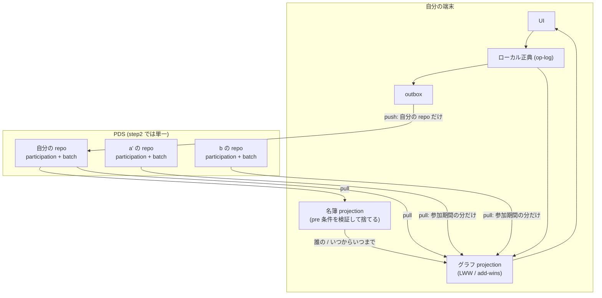

# step2 アーキテクチャ

> ステータス: **草案 (レビュー待ち)** / 作成日: 2026-08-30
> 位置づけ: [step1 アーキテクチャ](./step1.md) からの**差分**を記述する。
> 入力は [step2 要件仕様](../requirements/spec-step2.md) と `../requirements/spec/` 配下、
> 出力は [step2 実装計画](../plans/step2-implementation.md) の Phase 分割である。
>
> **この文書が扱うのはフェーズを横断する判断だけ**である。あるフェーズの中で閉じる設計は
> `plans/step2-phase<N>-*.md` に書く。ここに書くのは「あるフェーズで決めて、別のフェーズが
> 支払う」ものに限る。

## 0. step1 アーキテクチャは何を見込んでいたか

step1 の §8 は step2 を「**拡張エンジン**」と見込んでいた。実際の step2 は
[要件仕様](../requirements/spec-step2.md) のとおり「**共同作業できるようにすること**」である。

見込みが外れたわけではなく、**順序が入れ替わった**。step1 §8 が挙げた拡張群のうち
step2 で作るのは template ひとつだけで、それも toulmin model の直書き 1 本に絞ってある。
残りは step3 以降に残る。共同作業を先に置いたのは、conversensus の主題が
**コンフリクト = 合意形成の機会**であり、そこに到達するには複数の actor が同じグラフを
触っている状態が要るからである。

したがって step1 §8 の「乗り口だけ確保する」という約束は生きている。template は
§8 の表にある「projection に対する検証関数」の枠にそのまま入る。

---

## 1. 変わらないもの

step1 で確定し、step2 でも動かさないもの。**下の §2 以降を読むときの土台**である。

| | 内容 |
| --- | --- |
| 正典 | **操作ログ (op-log)**。集約 (`GraphFile` / `Sheet`) は projection であって保存形式ではない |
| ローカル-first | UI は常にローカル正典を読む。オフラインでも編集は途切れない |
| outbox | 未同期の操作を保持し、オンライン時に flush する |
| sync-provider の境界 | 同期は単一のインターフェースの裏に隠す。ATProto は 1 実装にすぎない |
| presentation | 同期しない (per-user・ローカル限定)。決定論的に再導出できるため |
| 全順序 | `orderBatches` の `(clock, actor, batchId)`。**actor をまたいでも決定論的**である |

最後の 1 行が step2 の前提として大きい。多アクタの畳み込みで新たに決めることが無い。

---

## 2. 多アクタの読み取りモデル

**step2 で最も大きい構造の変化はここである。**

step1 の同期は自分の repo に閉じていた。`atproto/collections.ts` の
`listRecords` / `getRecord` / `putRecord` は 5 箇所すべてが `repo: currentDid()` である。

step2 では**書くのは自分の repo だけ、読むのは参加者全員の repo**になる。

この非対称 (**write = 1、read = N**) から次が導かれる。

- **`SyncProvider` が表すのは「1 つの repo」ではなく「この File の同期」である。**
  現行の `FanoutSyncProvider` は既に local と remote の 2 系統を 1 つの provider の顔で
  束ねているので、remote 側を N repo へ広げるのは同じ形の延長になる。
  provider インターフェース (`push` / `pull`) は変えない
- **cursor は DID ごとに持つ。** 範囲取得 (step1 Phase 7) は repo 単位に rkey を seek する
  仕組みなので、参加者ごとに独立した cursor が要る
- **`repo` を引数として引き回す層が要る。** `collections.ts` を開くのは Phase 0 の仕事だが、
  「誰の repo か」を決めるのは名簿であり、名簿は Phase 1 にある。したがって
  **Phase 0 では口を開けるだけで、呼び出し側は変えない**

### 読む順序は名簿 → グラフに固定される

参加していた期間の op-log だけを同期すると決めた以上、**グラフを取りに行く前に名簿が
確定していなければならない**。これは実装の都合ではなく、意味論から出てくる順序である。

同期の 1 サイクルは次の形になる。

1. 自分の repo の participation を読み、名簿を projection する
2. 名簿から「いま参加している actor」と「各 actor の参加期間」を得る
3. 各 actor の repo の batch を、その期間の分だけ読む
4. 全員分を 1 つのグラフ projection に畳む (= implicit merge)

### 名簿の食い違いは正常な状態である

名簿を完全に同期することはできない。a が a' を招待した直後、まだ同期していない b の名簿に
a' はいない。**これは異常ではなく、b が「a' の参加を知らなかった」だけ**である。
b の projection には、同期するまで a' の操作が現れない。

「全員の名簿が一致していること」を不変条件にしてはならない。不変条件は
「**同じ名簿を入力にすれば、誰の手元でも同じグラフになる**」の方である。

---

## 3. projection は 2 段になる

step1 の projection は 1 種類だった (`projectBatches`: op を clock 順に畳む)。
step2 では**畳み込みの意味論が違う 2 つ**が並ぶ。

| | 名簿 projection | グラフ projection |
| --- | --- | --- |
| 入力 | participation collection | batch collection |
| 解決 | **pre 条件を検証し、満たさない op を捨てる** | LWW / add-wins |
| 「無効な op」 | ある | **ない** |
| 更新頻度 | 滅多に変わらない | 常時変わる |
| 期間外 | 履歴として残す | 同期対象から外れる |

**この 2 つを同じ畳み込み器に混ぜてはならない。**混ぜると projection が op の種類で分岐し、
「無効な op を捨てる」という名簿の中核が、グラフ側の「op はすべて有効」という前提と
同居することになる。collection を分けたのはこの帰結であって、逆ではない。

pre 条件の検証が名簿の中核なのは、そこから 2 つの性質が同時に出るからである。

- **招待されていない actor の承認は無効**になる。参加コードは秘密ではない (被招待者の DID を
  含むだけ) が、本人以外の承認は projection の段階で落ちる
- **取り消し合いが起きても、誰の手元でも同じ結論**になる。a が a' を取り消した後、それを
  知らない a' が a を取り消す op を出しても、clock 順では a' は既に名簿にいないので捨てられる

検証しなければ、取り消された側が取り消し返せてしまい、手元によって名簿の結論が変わる。

---

## 4. collection の割り当てと、implicit merge を書かない判断

| | 置き場 |
| --- | --- |
| 名簿 | **participation collection (新設)** |
| グラフ / branch / commit / explicit merge | batch collection (現行) |
| DtR graph、implicit merge が作る fork | batch collection (現行) |
| **implicit merge そのもの** | **書かない** |

**implicit merge を書かない**のが step2 のデータモデルで最も効く判断である。
implicit merge は冪等な導出なので、結果を書き戻す必要がない。むしろ書くと害がある。

- a が結果を書くと、b がそれを読んでまた畳む。**同じ操作が参加者の数だけ増殖する**
- 「a の op-log には a が意図した操作だけが載っている」という性質が壊れる
- **「参加していた期間の op-log だけを同期する」が意味をなさなくなる。** a のログに b の操作が
  入っていると、期間で切れない

3 番目が決定的である。§2 の読み取りモデルは、各 actor の op-log がその actor 自身の意図
だけを載せていることに依存している。

一方 **DtR graph と fork は書く**。どちらも**人間が下した判断**であって導出ではない。
同じ入力から自動的には再現できないので、記録しなければ失われる。fork を書かないと、
ユーザが解決したはずの fork が同期のたびに復活する。

**この割り当てが崩れる唯一の経路が [計画](../plans/step2-implementation.md) の U6** である。
DtR graph が既存の branch/commit モデル (branch = base コミット + 追記された batches) に
乗らなければ、batch collection の中に別の構造が要る。乗るか乗らないかは Phase 6 の設計で
確かめるが、**collection を 2 つに保てるかどうかがそこに懸かっている**ことは、Phase 1 で
participation collection を切る時点で意識しておく必要がある。

### 導出コストは払い切りにする

書かないと決めた以上、同期のたびに全参加者のログを畳むことになる。取得は DID ごとの
cursor で減らせるが、**projection は毎回全量**である (計画の U4)。
step2 の規模では問題にならないと見ているが、ここは「速いから選んだ」のではなく
**「正しさのために選び、コストを引き受けた」**ものである。実測して必要になったら
projection のキャッシュを考える — ただしそれは**導出結果のキャッシュ**であって、
op-log への書き戻しではない。

---

## 5. 競合の扱いが step1 から変わる

step1 アーキテクチャ §4「マージ方針」は、次の 2 つを述べていた。**step2 はどちらも改める。**

| step1 の記述 | step2 |
| --- | --- |
| add / delete は ATProto MST の OR-Set に委ねる (コンフリクトフリー) | **structure の競合を検出する。**「片方の操作がもう片方の前提を壊す」非対称な衝突は OR-Set では消えない |
| layout の並行変更は LWW で確定するのみ。**可視化しない** | **検出して通知する。**ただし DtR graph は起動しない |

step1 の記述が誤っていたのではなく、**step1 には共同作業が無かったので問題が現れなかった**。
1 人が複数端末で使う限り、削除依存も layout の取り合いも起きにくい。

step2 の扱いは 3 段になる。

| 種別 | 扱い | 起動 |
| --- | --- | --- |
| content | 対立として検出 | **DtR graph を強制起動** |
| structure | 対立として検出 | 通知し、そこから手動で選択的に起動 |
| layout | 対立として検出 | **通知のみ。**DtR は起動しない |

layout を DtR の対象にしないのは、共同編集中に二人が同じノードを動かすことが日常的に
起きるからである。毎回「対話して決着すべき競合」に上げると DtR がノイズで埋まる。
一方で検出しないと、位置が飛んだ理由がユーザに分からない。**通知だけがその中間**である。

### レイヤーの割り当て

| 責務 | どこ |
| --- | --- |
| 競合の**検出** | `shared/src/events/merge.ts` (ドメイン)。content + structure は実装済 (#206/#207/#208)、layout が残る |
| 決着までの**既定の振舞い** (add-wins) | `shared/src/events/project.ts` (projection)。**未実装** |
| **通知**と DtR の起動 | UI |

**add-wins が projection 側なのが要点**である。決着するまでの間もグラフは表示できなければ
ならず、clock-LWW のままだと削除が後に来た場合に DtR で議論する前に対象が消える。
「判断を保留するなら、情報を消さない方に倒す」— ネガティブ・ケイパビリティの方針が
データモデルに現れる箇所である。

### カスケード削除の推移的検出にはシグネチャの変更が要る

`mergeBranches` は base のグラフを受け取らないので、「削除された親の子孫」への参照を
追えない。追うには base の projection を渡す必要がある。add-wins 化と同じ Phase に置くのは、
どちらも「削除をどう扱うか」という一つの判断の裏表だからである。

---

## 6. DtR graph はグラフである

DtR graph は特別な機構ではなく、**conversensus のグラフそのもの**である。
グラフは op-log で表現されるので、DtR graph も op-log に載る。ユーザから「特殊な branch の
ように感じられる」のは実装の比喩ではなく、**実際に branch と同じ形をしている**からである。

この一致は意図的に保つ。DtR graph のために新しい永続化の仕組みを作らないことで、
§4 の「collection は 2 つで済む」が保たれ、既存の branch/commit/merge の操作
(commit・close・履歴の参照) がそのまま効く。

DtR graph が 2 つのグラフから成ることも、この見方と整合する。

- **dialogue graph**: 競合の解決を行うための対話のグラフ。任意のグラフでよく、
  toulmin template を当てる (§7)
- **resolve graph**: 競合を可視化し、解消のために編集できるグラフ。
  trunk の上に競合を重ねて表示する

**resolve graph は node label に依存する** ([dialogueToResolveGraph](../requirements/spec/dialogueToResolveGraph.md) が明記)。
現在 node は label を持たず、`node.setLabel` op も無い。label は template で追加されるので、
**template が DtR より前**に来る。これが計画の Phase 5 → 6 の順序の理由である。

### 承認しない actor がいたら既定は保留である

再 merge は、呼び出された actor 全員が承認したときに可能になる。承認しない actor がいたら
**普通はそのまま保留**する。呼び出し対象から外して先に進むこともできるが、それは
「外して進もう」と判断した場合の選択であって、既定の振舞いではない。

保留は放置ではなく状態である。保留の間 trunk には merge されず、branch は生き続ける。
その間も trunk は進むので、**保留が長引くほど再 merge は難しくなる**。
左サイドバーで「未決着の merge がある」ことが見えている必要がある。

---

## 7. template は step1 §8 の乗り口に乗る

step1 §8 は拡張を「projection に対する検証関数 (ローカル計算)」として乗せると述べていた。
template はその最初の実例である。

- **step2 で作るのは toulmin model の template を直接コードに書いたもの一つだけ**である
- template の一般的な制約の仕組み — 制約違反をどう扱うか、**同期で流れ込んできた他の参加者の
  操作が制約に違反していたらどうするか** — を決めるのは step3 以降
- step2 では接続制約は**警告のみ**で、拒否しない

2 番目を step2 でやらないのは、共同作業と制約が交差する場所だからである。他者の op を
制約違反として拒否すると、§2 の「同じ名簿を入力にすれば誰の手元でも同じグラフになる」が
壊れる (誰がどの template を持っているかで結論が変わる)。ここは共同作業が動いてから
考える方が安全である。

`node.setLabel` op の追加は**語彙の変更**なので、同期を触る Phase 2 と時期を重ねない。

---

## 8. 未決事項

[実装計画](../plans/step2-implementation.md) §5 の U1〜U7 のうち、**アーキテクチャに跳ね返るもの**
だけをここに再掲する。残りはフェーズの設計で閉じる。

| ID | 内容 | 跳ね返る先 |
| --- | --- | --- |
| **U2** | 他 actor の repo にある blob の取り込み。`resolveImageUrl` の PDS 経路が `loggedInDid()` に閉じており、§2 の「read = N」が blob には及んでいない | §2 の読み取りモデル |
| **U4** | implicit merge を書かない以上、projection は毎回全量。キャッシュするなら**導出結果のキャッシュ**であって op-log への書き戻しではない | §4 |
| **U6** | DtR graph が既存の branch/commit モデルに乗るか。乗らなければ batch collection 内に別の構造が要り、§4 の割り当てが崩れる | §4, §6 |

**U6 は Phase 6 を待たずに潰す価値がある。**Phase 1 で participation collection を切る時点で
§4 の割り当てを前提にするので、そこが崩れると後戻りが大きい。最小の PoC スライスで
「DtR graph を branch として書いて読み戻せるか」だけを先に確かめる案を、Phase 0 か
Phase 1 の設計で判断する。

---

## 9. step1 からの差分 (要約)

| 観点 | step1 | step2 |
| --- | --- | --- |
| 参加者 | 1 人 (複数端末) | 複数 actor (単一 PDS・招待制) |
| remote の読み | 自分の repo だけ | **参加者全員の repo。書くのは自分だけ** |
| 同期のトリガ | 起動時 / `online` / 手動 | **定期ポーリング**を追加 (firehose は step3) |
| projection | 1 種類 (グラフ) | **2 段**。名簿 (pre 条件検証) → グラフ (LWW / add-wins) |
| collection | batch | batch + **participation (新設)** |
| structure の競合 | OR-Set に委ねる (検出しない) | **検出する** (削除依存・並行変更) |
| layout の競合 | LWW のみ・可視化しない | **検出して通知する** (DtR は起動しない) |
| 決着までの既定 | clock-LWW | **add-wins** (情報を消さない方に倒す) |
| 競合の解決 | 可視化まで | **DtR graph** (対話 + 解決、承認して再 merge) |
| node の label | 無い | **有る** (template が追加する) |
| プロパティ | 画像のシステム・プロパティのみ | **property editor** で custom を編集できる |
