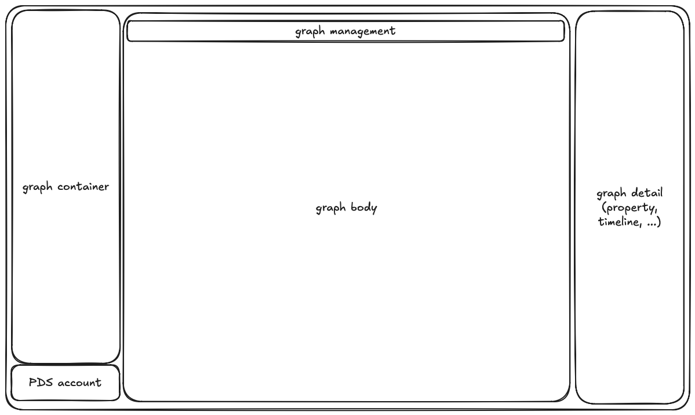

# design language

> [step3](../step3.md) の子文書。出所: Notion「design language」(2026-09-30)。

conversensus は, 以下のデザイン・スタイルから成る. これは, 現在広く使われている分散型
コラボレーション・アプリケーション (e.g. Notion, Obsidian) のデザイン言語に倣うものであるが,
その一方で, conversensus の特徴であるグラフという言語をサポートするものでもある.

> 見た目の体系 (色・文字・余白・アイコン・状態・ダイアログ・言葉・グラフの描き方) は
> [visual language](./visual-language.md) に置く (#266)。

## 左サイドバー

- (Step 3) 表示幅 (横) を増減可能であること
- (Step 3) 折り畳め, 広げられること

### 上部

- graph container (File, Sheet) を管理する
  - Branch は Sheet (= graph) の詳細 (右サイドバー) に移動すべきという議論もあるが,
    とりあえず今のままにする
  - File 全体アクション
    - 名前を指定して追加
    - import
    - participate
  - 個々の File
    - 名前
    - 参加者ダイアログ: 変更なし
    - 詳細の表示/アクション
      - 名前の表示/変更
      - 概要の表示/変更
      - export
      - delete
      - (Step 3) 「保存」 → 「OK」
  - Sheet の追加
    - template の指定
    - 詳細の表示/アクション
      - 名前の表示/変更
      - 概要の表示/変更
      - 削除
  - Branch の追加: 変更なし
- (Step 3) File を Folder の入れ子で管理できるようにしたい. これは, local なもので,
  actor 固有 (端末間共通) とする
  - 補助的な情報なので, event ではなく, state として PDS に入れればいいと思う
  - Folder は再起的に階層化できる
  - 下位の Folder の内容表示を折り畳んだり, 拡げたりできる
  - 作成されたり, 招待されたり, import された File はいったん, トップ・レベルに置かれ, その後ユーザ自身が必要に応じて Folder に移動する
    - トップ・レベルに置かれた Files はまとめて表示し, Folders とは区切る
    - File を Folder からトップ・レベルに戻す (Folder 管理からは除外する) こともできる
  - その後, File は Folder 間を移動させることができる
  - File の名前は重複することがあり得る (共有なので) が, Folder の名前はトップ・レベル, または同じ階層では重複させない (整理のための仕組みなので)
  - Folder は空の場合 (File や下位 Folder を持たない) に限り, 削除できる

  > **端末間の同時編集 (2026-10-02 の議論で決定)**
  >
  > Folder の操作は手元の写しに対して行う (オフラインでも操作できる) ので、
  > 上の制約は同期の時点で破れうる。そのときは次のように解く。
  >
  > - **同じ階層で名前が重複したら、片方の名前を変える。**2 台がそれぞれオフラインで同じ名前の
  >   Folder を作ると、各端末では正しい操作のまま同期で重複が生まれる。PDS に訊いても
  >   読む・検査する・書くの間に別の端末の書き込みが挟まりうる (`swapRecord` で防げるが、
  >   オフラインで操作できなくなる)。
  >   - 設計上の注意: Folder の木を 1 record の後勝ち (LWW) で持つと重複は起きない代わりに、
  >     片方の端末の操作がまるごと消える。名前を変えて両方を残すには、項目ごとに併合できる形で持つ
  > - **行き先の無い File はトップ・レベルに戻す。**端末 A が File を Folder X に移すのと同時に、
  >   端末 B が (B から見て) 空の X を削除した場合など。
  > - **削除された File は Folder の表示から黙って外す。**自分の別の端末での削除と、
  >   共有相手の削除の伝播 (ANA-118) の両方。共有が外れても File は残るので、こちらは対象外。
  >   - 削除された File しか持たない Folder は **空とみなす** (見た目が空なのに削除できない
  >     Folder を作らない)
- (Step 3) トップ・レベルで File 名, Sheet 名あるいは Folder 名での検索ができる

### 下部

- アカウント (現在の実装では ATProto/PDS) を管理する
  - ハンドル名
  - (Step 3) クラウド同期状態 → 「クラウド」という用語は意味が曖昧な気がする. 自分の PDS?
  - (Step 3) 「今すぐ同期」ボタン → これも自分の PDS との同期?
- conversensus は local first なので, local と PDS との同期の管理もここに含む
  (共同作業は含まない)

## ヘッダ

- 個々のグラフを管理する
- 左サイドバーで選択され, ボディで表示されているグラフ (Sheet) 全体に関するオプションや
  アクション, 状態を表示する
  - Sheet 内検索
  - Undo/Redo
  - グループ化/解除
  - PNG export
  - property editor 表示の on/off
  - (Step 3) map 表示の on/off
    - graphical view 時のみ enabled

## ボディ

- グラフを管理する
- (Step 3) 以下の二種類のモードがある
  - single
    - 一つのグラフを表示する
  - multiple
    - 一つ以上のグラフを表示する
    - 以下のような特別な場合に用いられる
      - merge 時に merge 元/先の二つのグラフを表示する
- (Step 3) 無限キャンバス (端に要素を置いたところまで動的に拡大する)

## フッタ

- 今は特にない

## (Step 3) 右サイドバー

- ボディ内で選択されているグラフ要素 (選択されていないときにはグラフ全体) に関する,
  詳細を管理する
- property editor
  - 👉 [property editor](./property-editor.md)
- timeline view
- operation inspector
- change inspector
- ここには表示したい詳細に応じて, さらに他の pane が追加されるかもしれない
- 表示幅 (横) を増減可能であること
- 折り畳め, 広げられること
