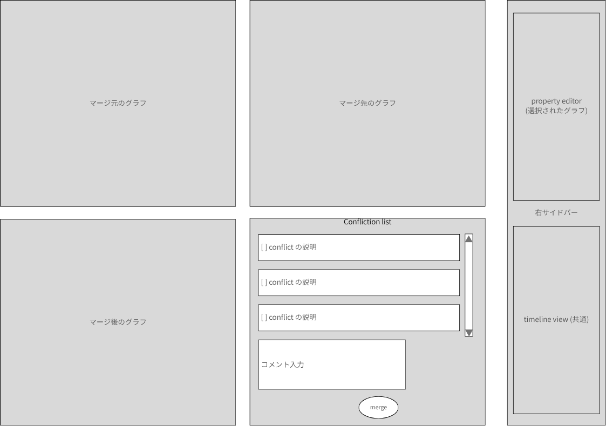

# merger

> [step3](../step3.md) の子文書。出所: Notion「merger」(2026-09-30)。
> 未決: implicit merge から起動したときの merge 元/先 (O2)、作業中に merge 先が進んだときの扱い (O3)。

merger は、人間にとって本質的に複雑な、グラフのマージという作業を支援する view である。

## merger の起動

merger は、以下のタイミングで起動される。

- explicit merge 時に conflict が検出されたとき
- implicit merge 時に conflict が検出され、それが通知され、通知内の merger 起動リンクを
  踏んだとき
  - ToDo: 通知とは何か? → [notification](./notification.md)

merger は、進行中の作業を邪魔しないように新規タブで開かれる (下図は左サイドバーは描くのを
省略している)。

## 3 way-merge

上部には、merge 元、merge 先と merge のための編集の三つの graph view が表示される
(3 way merge)。それぞれは、基本的に通常のグラフ表示と同じである。
(限られた画面にたくさんの pane を詰め込むやり方は工夫したい)

- merge 元/先グラフは編集不可である
- merge 後グラフは、競合部分以外も含めて全体が編集可である
  - 競合解消のために、非競合部分を変更する必要もあり得るので
  - これらの操作は branch 側の op-log に積まれる
- いずれかのグラフで node/edge を選択すると、他のグラフでも対応する要素が選択状態になる
  - 三つのグラフ自体のうちどれかが選択 (アクティブ化) されると、そのグラフ、あるいは
    そのグラフの要素に関する詳細情報が右サイドバーに表示される
  - プロパティ・エディタでも、merge 元/先グラフの場合は変更できない
- merge 元/先グラフは、互いとの差分 (追加/削除/変更、ラベル/プロパティ/コンテンツ) を
  通常の branch と同様の方法で差分表示する
- merge 後グラフは、merge 先グラフとの差分を通常の branch と同様の方法で差分表示する
- merge 元/先グラフは、競合部分を点線で囲うなど差分表示とは異なる方法で競合表示する
  - 両方とも同じ部分が競合表示されているはず
- merge 元/先グラフでは、node/edge の右クリックで以下のメニューが出る
  - merge: こちらの差分を merge 後グラフに取り込む
  - 複数の node/edge を選択して、一斉に取り込むことも可能
  - このメニューから merge した上で、さらに merge 後グラフを直接変更することもあり得る
- どの操作も undo/redo 対象となる

## conflict list

conflict list の上部には、解消すべき競合の一覧が出る。

- チェック・リスト
- conflict している要素
  - node/edge
  - その差異

チェック・リストは「その競合を解消した」とユーザが理解した時にチェックを入れる。
とは言え、これが正しいかを形式的に検証することは難しい。

すべてのチェック・リストにチェックが入ったら、merge ボタンが有効になり、merge できる。

厳密には、merge が開始されてから、merge ボタンをクリックするまでの間に merge 先がさらに
先に進んで、再び競合が起きている可能性はある。その場合には、merge 先の内容が更新され、
merge 作業は継続する。

## step forward council

本来ならば、merge は複数の共同作業者、コミュニティ・メンバが関わるべき課題である。
しかし step3 では、その課題は先送りすることにする。
まだその実態もあるべき姿も見えていないし、技術的要素 (通知、リアルタイム性など) も
不足しているからである。
