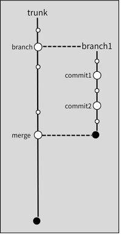
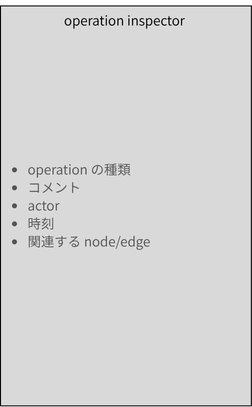
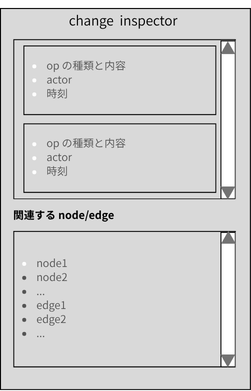

# timeline view

> [step3](../step3.md) の子文書。出所: Notion「timeline view」(2026-09-30)。

timeline view は選択した sheet あるいは node/edge の時間軸上の変化 (変化を起こす操作) を
可視化するものである.

## version tree

- 左側に version tree を表示する

  

  - 現在いる trunk/branch が分かるように強調表示する
  - 時間線上の
    - 大きな白丸は branch/commit/merge (これらを operation point と呼ぶ) を表す
      - 名前やコメントが付いている操作
    - 小さな白丸は op-log に記録される batch (これらを change point と呼ぶ) を表す
      - nodes/edges が選択された状態ならば, それらが関連するものに限定する
      - 何も選択されていない状態ならば, その sheet 全体 (すべての batch)

## operation inspector

- operation point をクリックすると, その詳細が右サイドバー内の inspector に表示される
  - inspector 内で view graph すると, その時点でのグラフが新規タブに read-only で表示される

  

## change inspector

- change point をクリックすると, その詳細が右サイドバー内の inspector に表示される
  - inspector 内で, その batch に含まれる他のグラフ要素 (node/edge) を見ようとすると,
    その時点でのグラフが, 新規タブの中でそのグラフ要素がハイライトされて見える

  

version tree, operation inspector, change inspector はそれぞれ最大一つだけが表示される
ものとする (単純化のため).
