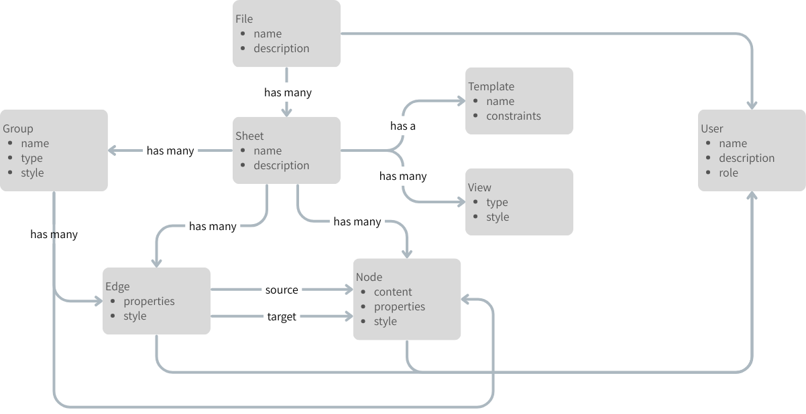

# requirement ontology

- Node と Edge の集まりが有向グラフを表す
  - Node は content と properties と style を持つ
    - content はテキストや画像などのリソースを表す
    - properties は content を補足する情報を表す
    - style は content をどのように表示するかを表す
  - Edge は source と target と properties と style を持つ
    - source と target は Node を指す
    - properties は source と target の関係を表す
      - その一つに label という property がある
    - style は source と target の関係をどのように表示するかを表す
- Node と Edge を集めて Group にすることができる
  - Group は name と type と style を持つ
    - name は Group の名前を表す
    - type は Group の種類を表す
    - style は Group をどのように表示するかを表す
    - Group を Node の一種としてもよいが, 現時点では Node と Group は別のものとする
      - 現時点では Group は論理的なものよりは意味的なものとする
- View はその Sheet で有向グラフをどのように表現するかを表す
- Template はその Sheet の有向グラフが満たすべき制約を持つ
- Sheet には複数の有向グラフが存在する
  - Sheet は name と description を持つ
    - name は Sheet の名前を表す
    - description は Sheet の説明を表す
- File は複数の Sheet をまとめたものである
  - File は name と description を持つ
    - name は File の名前を表す
    - description は File の説明を表す
  - File の物理的な実装としていわゆるファイルを利用するとは限らない
