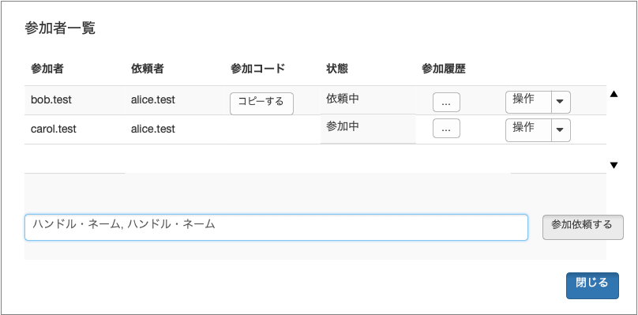
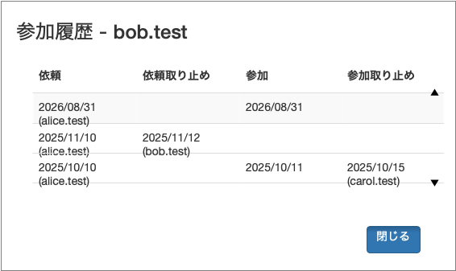
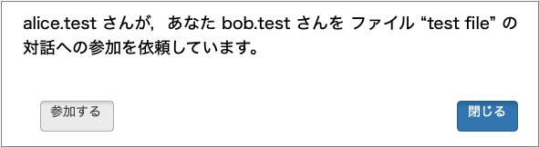

# participation

- Participation (参加) は, conversensus での共同作業の単位である
- DID を持つアクタは, File ごとに共同作業に参加する
- step2 では, File への参加要請や参加表明は conversensus の外で何らかの形で行われるものとする
- step2 では, 参加するアクタは全員同じ PDS ノードにアカウントを持っているものとする

## 名簿

File f の名簿は, 「誰が, いつからいつまで参加していたか」の記録である. 各アクタの記録からの projection によって導かれるので, **各参加者が自分の手元で独立に計算する**.

- $f.participatingActors$ は, ある時点で f に参加しているアクタの集合を表す
- 参加期間が記録されているので, 他のアクタの op-log を同期するときは, **そのアクタが参加していた期間の op-log だけ**を対象とする

### 名簿の置き場

名簿は, **グラフの op-log とは別の collection** に置く. 理由は以下の通り.

- **畳み込みの意味論が違う**. 名簿の op は後述の pre 条件を検証して, 満たさないものを捨てる. グラフの op は LWW / add-wins で解決するので「無効な op」という概念がない. 同じログに混ぜると projection が op の種類で分岐する
- **読む順序が「名簿 → グラフ」に固定される**. 参加していた期間の op-log だけを同期すると決めたので, グラフを取りに行く前に名簿が確定していなければならない
- **被依頼者の検証が 1 レコードで済む**. 被依頼者は参加コードを受け取った時点で「本当に自分が依頼されたか」を依頼者の repo で確かめたい. 被依頼者はまだ参加していないので, 依頼者のグラフを読む筋合いがない
- 名簿は滅多に変わらず参加終了後も履歴として残す. グラフは常時変わり期間外は同期対象から外れる. 更新頻度もライフサイクルも違う

各レコードは clock を持つので, 別 collection にしても「あの時点の名簿」は引ける.

### 名簿の食い違い

名簿を完全に同期することはできない. actor a が actor a' に依頼した直後, まだ同期していない actor b の名簿には a' がいない. この食い違いは許容し, b は単に「a' の参加を知らなかった」ものとして扱う. したがって b の projection には, 同期するまで a' の操作は現れない.

## participation に関する activity

- actor a が actor a' を file f に参加依頼する
  - pre
    - $a \in f.participatingActors \land f \in a.participatingFiles$
  - post
    - $a' \in f.invitedActors \land f \in a'.invitedFiles$
- actor a が file f への依頼を承認する
  - pre
    - $a \in f.invitedActors \land f \in a.invitedFiles$
  - post
    - $a \notin f.invitedActors \land f \notin a.invitedFiles$
    - $a \in f.participatingActors \land f \in a.participatingFiles$
- file f に参加している actor a が参加を取りやめる
  - pre
    - $a \in f.participatingActors \land f \in a.participatingFiles$
  - post
    - $a \notin f.participatingActors \land f \notin a.participatingFiles$
- file f に参加している actor a が actor a' の依頼/参加を取り消す
  - 承認の**前後を問わず**, 同じ「取り消し」として扱う
  - pre
    - $a \in f.participatingActors \land f \in a.participatingFiles$
    - $a' \in f.invitedActors \lor a' \in f.participatingActors$
  - post
    - $a' \notin f.invitedActors \land f \notin a'.invitedFiles$
    - $a' \notin f.participatingActors \land f \notin a'.participatingFiles$

- actor a が, **誰も参加していない** file f を引き取る (2026-09-05 追加)
  - pre
    - $f.participatingActors = \emptyset$
    - f の起点 (genesis) が記録されている
  - post
    - $a \in f.participatingActors \land f \in a.participatingFiles$

被依頼者が依頼を明示的に断る activity は設けない. 承認しなければよい.

### 誰も参加していない file を引き取る

**最後の 1 人が参加を取りやめると, 名簿は空になる.** そこからは参加依頼の pre 条件
($a \in f.participatingActors$) を誰も満たさず, 起点は file に 1 つなので置き直しもできない.
**誰も二度と参加依頼を出せない** — file は手元に残っているのに, 共同作業だけが永久に閉じる
(2026-09-05 の実機テストで行き止まりを確認した).

そこで「引き取り」を設ける. **file 作成者に限らない** — 誰も参加していないのだから,
作成者を特別扱いする根拠が無い. 畳み込みは「その file を持っているか」を条件にしない:
名簿の読み出しは**起点から辿れる repo しか訪ねない**ので, 判断ログに名前の無い actor が
引き取りを書いても誰にも読まれない (起点と繋がっていない genesis が読まれないのと同じ理屈).

**同時に 2 人が引き取っても, 通るのは 1 人だけである.** clock 順で先の 1 人が名簿に入り,
後の 1 人は「まだ参加している人がいる」で捨てられる. 誰の手元でも同じ結論になる.

**引き取りは新しい参加期間を開くだけである.** 誰もいなかった期間まで遡らない.
遡って開くと, 6-3 (参加していない期間の操作は project されない) を
「名簿を空にしてから引き取る」経路で迂回できてしまう. したがって, 誰もいない間に行った
操作は, 引き取った後に呼んだ共同作業者には届かない (残したければ 6-2 と同じく別の File
としてコピーする).

#### 引き取りは「どの状態」から始まるか (2026-09-05 の実装の記録)

**引き取った本人にとっては, 手元の今の状態からである. 何も巻き戻らない.**
引き取りは判断ログに op を 1 つ書くだけで, グラフの op-log には触らない. **ローカル正典は
その actor の権威であって同期の対象ではない**ので, 参加期間フィルタは自分の repo から
読んだ batch には適用しない (`participationFilter` の「⚠️ 自分の repo には適用しない」).
共有を止めた後にローカルで加えた変更も, そのまま残る.

**引き取った後に呼ばれた共同作業者にとっては,「その人が止めた状態 + 引き取った後の変更」
である.** 受信側は著者の参加期間でフィルタするので, 空白期間の op は落ちる.

つまり**両者の projection は食い違う** — 引き取った本人にだけ空白期間の変更が見える.
これは「新しい期間を開くだけ」を選んだことの帰結であり, 意図した動作である.
食い違わせたくなければ, 引き取る前に別の File としてコピーしておく (6-2).

> 実測 (alice が clock 1 で作成, 4 で取り消され, 6-8 をローカルで編集, 9 で引き取り,
> 11 で編集): alice の参加期間は `[1,4)` と `[9,∞)`. 後から呼んだ carol が alice の repo
> から受け取るのは clock 2 と 11 だけで, 6-8 は `outside period` として落ちる.
> alice 自身の手元には 2, 6, 7, 8, 11 が全部残る.

### 離脱した後, 手元の File はどうなるか

**手元からは消えない.** ローカルの op-log はその actor 自身の写しであり, 参加を取り消された
からといって, それまでに見ていた内容を取り上げる筋合いは無い. 左サイドバーにも残る.

**同期は止まる.** 離脱した actor は,

- ほかの参加者の repo を**読まない** (以後の編集は届かない)
- 自分の編集は自分の repo に書かれ続けるが, ほかの参加者はそれを**畳み込みで落とす**
  (参加期間の外なので)

この非対称 —「手元には残るが同期はしない」— は画面に出さなければならない. 出さないと,
**もう同期されない File が普通の File に見える** (2026-09-05 の実機テストで実際に混乱した).
左サイドバーのその File に「同期していません」と出す.

> 「離脱中は受け取っていない」ことは,ワークフロー 6-3 (再参加する前に標準 projection へ
> 同期しなければならない) の前提でもある. 受け取り続けるなら同期義務は要らない.

### pre 条件の検証

名簿を変える op は, **projection のときに clock 順に畳み込みながら pre 条件を検証し, 満たさないものは捨てる**.

これによって以下が決まる.

- 参加依頼されていないアクタが承認しても無効である (= UI の状態でいう invalid). 参加コードは秘密ではない (被依頼者の DID を含むだけ) が, 本人以外の承認は projection の段階で落ちるので, 第三者が参加コードを入手しても参加できない
- 取り消し合いが起きても, 誰の手元でも同じ結論になる. 例えば a が a' を取り消した後で, それを知らない a' が a を取り消す op を出しても, clock 順では a' は既に名簿にいないので, その op は pre 条件を満たさず捨てられる

pre 条件を検証しないと, 取り消された側が取り消し返せてしまい, 手元によって名簿の結論が変わる.

## ワークフロー

1. actor a が file f を作る
    1. actor a は file f に自動的に参加する
2. actor a’ からの希望, または f の任意の共同作業参加者 actor a の意思により, actor a’ を file f の共同作業に参加依頼する
    1. actor a は actor a’ の DID did(a’) を入手する
    2. did(a’) から共同作業への参加 participation p(f, a’) の 参加コード participation-code(p, a) を生成する
    3. actor a は actor a’ に participation-code(p, a) を渡す
    4. actor a’ は participation-code(p, a) を使って, 依頼を承認する
3. この後, 共同作業者たちの file f の projection には actor a’ の file f’ を加えるようになる
4. file f の任意の共同作業者 actor a が意図して, あるいは actor a’ 自身の意思によって, actor a’ の file f’ への参加を取り消す
5. この後, 共同作業者たちの file f の projection には actor a’ の file f’ を加えないようになる
6. actor a’ が file f に参加していない期間に行った file f’ に対する (local な) 操作は, file f の他の共同作業者 actor a の file f には project されない
    1. その op-log は a’ 自身の repo には残る. 他の参加者に project されないだけである
    2. その期間の状態を残しておきたければ, 別の File としてコピーする
    3. そのような操作の結果に依存する新たな操作は, actor a にエラーを引き起こす. したがって, actor a’ が新たに (あるいは再度) 共同作業に参加する前に, file f の標準的な projection に同期しなければならない

## UI の例

### 参加者一覧 + 参加依頼

- 左サイドバーの File 欄右アイコンから, 以下のようなダイアログを表示する

  

- 上段の表は, 現在依頼中, 参加中, または過去に参加したことのある actor の一覧である
  - actor 数はせいぜい数十名程度と予想するので, まずは参加者のハンドル名のアルファベットでソートすればよい
  - スクロールは必要だろう
  - 状態は以下のものを表示する
    - 依頼中 (誰かが, 下段の「依頼」を使って依頼した)
    - 参加中 (被依頼者が参加を承認した)
    - 離脱中 (参加を取りやめた. 自分で辞めたか, 辞めさせられたかは問わない)
    - 依頼中に依頼が取り止められた場合には, その依頼はなかったものとする. つまり,
      - 今までにこのファイルに参加したことがあれば, 離脱中になり,
      - 今までにこのファイルに参加したことがなければ, 表示されない
  - 参加履歴は, ダイアログを開いて, その actor の参加歴を依頼日時の降順に表示する

    

    - 依頼中 → 依頼日時のみ表示
      - 依頼をキャンセルされた場合には, 依頼取り止め日時が表示される
    - 参加中 → 依頼日時と参加日時のみ表示
    - 離脱中 → 依頼日時と参加日時, 参加取り止め日時のみ表示
    - 依頼, 依頼取り止めと参加取り止めは誰がそれを行ったかも表示する
    - スクローラはなくてもいいかもしれない
  - 操作は, その actor に対してできる操作を (例えば) pull down メニューで選択できる
    - 依頼中 → 依頼キャンセル
    - 参加中 → 参加取りやめ
    - 離脱中 → 再度参加依頼
      - 再度依頼すると, その actor の状態が依頼中になり, 参加コードを「コピーする」ボタンが表示される
- 下段のテキスト・フィールドに参加依頼したい actor のハンドル名を `,` 区切りで並べて「依頼する」
  - すると, 上段にその actor が依頼中として表示される
  - 参加コードを「コピーする」と参加コードが OS レベルのペースト・ボードにコピーされるので, それを何らかの手段で依頼相手の actor に送る
    - 「コピーする」が表示されるのは相手が参加するまでの間だけである
    - 参加コードは, 依頼相手ごとに異なることに注意
  - 依頼相手が見つからなかったり, すでに参加中であったりする場合には, その旨をダイアログで知らせる

> **誰も参加していない file では, 自分の行に「この File を引き取る」が出る** (上記).
> 参加者が 1 人でもいれば出さない — 押せてしまって畳み込みで捨てられるより, 押せない方がよい.

### 参加依頼の承認

- 左サイドバーの最上段 (File の import などと同じレベル) のアイコンから下のようなダイアログを表示する

  

- OK すると, 下のようなダイアログが出て, 「参加する」とそのファイルに参加できる

  

- 他のメンバの参加者一覧では, その actor が「参加中」となる
- 依頼されたのが自分でない, 依頼先が異なる PDS エンドポイントである, すでに依頼をキャンセルされていた, すでに参加していた, などエラーになった場合には, その旨をダイアログで知らせる

### 参加コード (あるいは URL)

- 必要な情報は
  - 依頼者の DID
  - 被依頼者の DID
  - FileId
  - 実際にはこれらを JSON などで適当にフォーマットして, 圧縮, エンコードしたものでもいい
  - conversensus の web アプリケーション版があれば, これらを URL にエンコードしてもいいかも

> **用語**: ここでいう「参加コード」は File の共同作業に参加するためのものである. PDS のアカウントを作成するための「招待コード」(→ [spec-step2](../spec-step2.md) の「アカウントを作成する」) とは別物である.

## 未決

- 名簿を別 collection にすると, グラフを読まずに「この File に誰が参加しているか」が読める. step 2 では単一 PDS + 参加依頼制なので実害はないが, 将来 File の private 設定を入れるときに再検討が要る (→ step 3)
