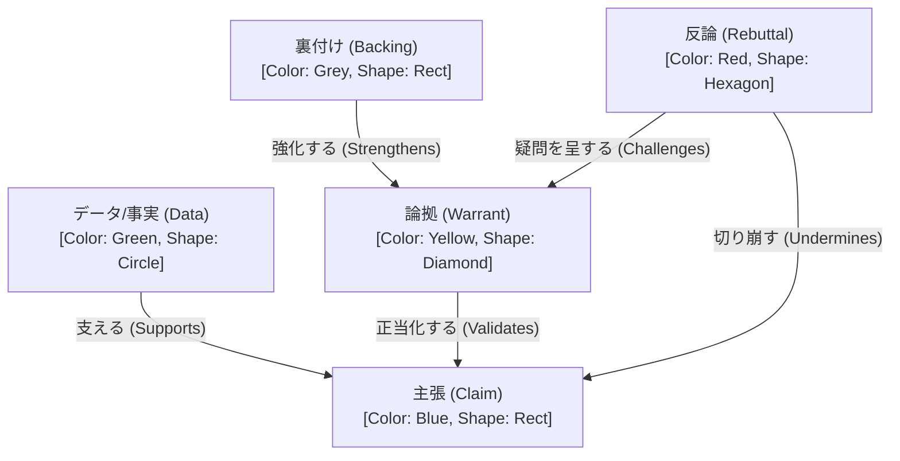

# template

template は, あるグラフに対して以下を定義するものである.

- node の種類
  - ラベル (今は markdown node は label を持たないので, 追加する必要がある) 名
  - プロパティの定義
- edge の種類
  - ラベル名
  - プロパティの定義
- node と edge の間の関係/制約
  - どの種類の edge, node が接続可能か
  - 多重度 (→ step 3)
- プロパティと視覚属性の間の対応付け (→ step 3)

template は, 以下の状態がある.

- template 定義
  - 最初は, アプリケーション内に作り込んでも良い
  - 将来的には, template 自体をグラフとして, ユーザが定義できて欲しい (→ step 3)
- template 適用
  - 最初は, 対話グラフに対して作り込まれた特定の template が最初から適用されていても良い
  - 将来的には, sheet 作成時, あるいは編集中 (後述) にユーザが適用する template を指定する (→ step 3)
- template 実行
  - リンクされている sheet に対して, 編集中に UI がその定義に基づいて動作する. 例えば,
    - node の作成時に, その種類 (ラベル) を選択するメニュー
    - edge の種類 (ラベル) を選択するメニュー
    - プロパティ・エディタ
      - プロパティの追加時に名前を選択するメニュー
      - プロパティの値を設定するときの型チェック
    - edge 接続の受け入れ/拒否 (警告)

対話グラフでは, 例えば toulmin model に対応する template をリンクして, 論証分析に基づく対話を促進する.

以下を検討する必要がある (→ step 3).

- 一つの sheet に複数の template を適用可能か (とりあえず 1)
- sheet を (作成時ではなく) 作成後/変更後に template を追加/削除できるか (とりあえず不可)

## 例

