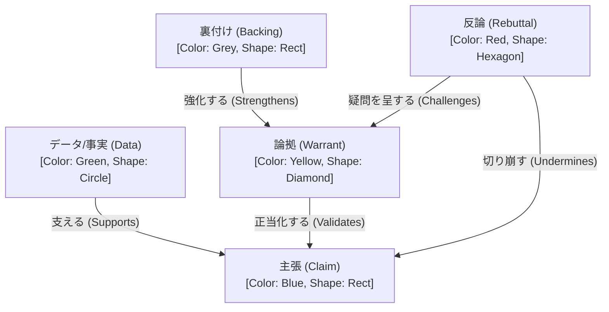

# template

template は, あるグラフに対して以下を定義するものである.

- node の種類
  - ラベル名 (step 2 で node に label を追加した)
    - 既存のノードのラベルは, edge の場合と同じく空でよい
- edge の種類
  - ラベル名
  - プロパティの定義
- node と edge の間の関係/制約
  - どの種類の edge, node が接続可能か
  - 多重度 (→ step 3)
- プロパティと視覚属性の間の対応付け (→ step 3)

template は, 以下の状態がある.

- template 定義
  - 最初は, アプリケーション内に作り込んでも良い
  - 将来的には, template 自体をグラフとして, ユーザが定義できて欲しい (→ step 3)
- template 適用
  - 最初は, 対話グラフに対して作り込まれた特定の template が最初から適用されていても良い
  - 将来的には, sheet 作成時, あるいは編集中 (後述) にユーザが適用する template を指定する (→ step 3)
- template 実行
  - リンクされている sheet に対して, 編集中に UI がその定義に基づいて動作する. 例えば,
    - node の作成時に, その種類 (ラベル) を選択するメニュー
    - edge の種類 (ラベル) は両端の node から決まる (下記 semantics)
      - 候補が一つに定まればそれになる. **複数あるときだけ選択するメニューを出す**
      - 候補が無い (制約を満たさない) 接続はそもそもできない
    - プロパティ・エディタ
      - プロパティの追加時に名前を選択するメニュー
      - プロパティの値を設定するときの型チェック (→ step 3. 下記)

**型チェックは step 2 では行わない.** [property editor](./propertyEditor.md) が「型制約のチェックは今回は行わない」「システムによるチェックは少なくとも step 2 では行わない」と定めているので, それに揃える. template の制約の仕組み一般が step 3 送りである以上, その一部である型チェックだけを step 2 に置く理由がない.

step 2 の property editor は**型を値から推論して表示するだけ**である. したがって「型が先に決まっていて値がそれに従う」という関係は step 2 には存在せず, 型は値の従属変数である.

対話グラフでは, 例えば toulmin model に対応する template をリンクして, 論証分析に基づく対話を促進する.

step 2 で作るのは **toulmin model の template を直接コードに書いたもの一つだけ**である. template の一般的な制約の仕組み (制約違反をどう扱うか, 同期で流れ込んできた他の参加者の操作が制約に違反していたらどうするか, など) を決めるのは step 3 以降とする.

以下を検討する必要がある (→ step 3).

- 一つの sheet に複数の template を適用可能か (とりあえず 1)
- sheet を (作成時ではなく) 作成後/変更後に template を追加/削除できるか (とりあえず不可)

## 例

## template semantics

step 2 の段階では, テンプレートの実装は次の二つの側面を持つ.

一つは, toulmin model を対話グラフに用いること. もう一つは, step 3 でより一般的なテンプレートを実現するための洞察を得ること.

まずは, toulmin model をユーザにどのように提供するかについて述べ, 続いて, それをより一般的なテンプレート記述に埋め込む例を考える.

### toulmin model

step 2 では, toulmin model を以下のように表現する.

- 五種類の node (= toulmin node)
- 五種類の edge (= toulmin edge)
- それらの間の接続関係

それらに関して, 以下のように実現する.

- toulmin node の種類と, それに対応するラベルは作成時に決まり, その後変更することはできない
  - toulmin node の
    - content は通常の markdown node と同じである
    - property
      - jp.co.metabolics.toulmin.kind: toulmin node の種別
  - ただし, ユーザはこれら五種類以外の node を自由に作り, ラベルを付け, 変更することができる (今までと同様)
- toulmin edge の種類は, 両端の nodes が決まれば自動的に決まり, ラベルはそれに対応するものになり, その後変更することはできない
  - **toulmin では候補が二つ以上になることがない** (五種類の (から, へ) の組がすべて相異なる) ので, 選択のメニューは出ない. 一般の template では候補が複数あり得る (→ step 3)
  - ただし, ユーザは toulmin node 以外の node とその他の (toulmin node を含む) node の間に自由に edge を繋ぎ, ラベルを付け, 変更することができる
  - toulmin edge の property
    - jp.co.metabolics.toulmin.kind: toulmin edge の種別
  - toulmin node 間の toulmin edge は決められた五種類のみとする (ユーザがラベルを自由に付けたり, ラベルのない edge で繋ぐことはできない)

### template 記述

とりあえずは操作的な記述を考える.

- OnCreation
  - toulmin node だった場合
    - node.label ← node の種類名
  - edge の両端が toulmin node だった場合
    - toulmin edge になる
    - edge.label ← edge の種類名
  - その他の場合は, 特に制約はない
- OnMutation
  - toulmin node だった場合
    - label は変更できない
  - toulmin edge だった場合
    - label は変更できない
    - **edge の種類が変わらない範囲でのみ**接続を変更できる
      - 可: データA → 主張A を データA → 主張B に (組は (データ, 主張) のままなので種類も label も変わらない)
      - 不可: データA → 主張A を 論拠A → 主張A に (組が変わると種類は「正当化する」になるが, label は変更できない)
      - 不可: toulmin node 以外への繋ぎ替え (種類が無くなる)
- OnValidation
  - OnValidation 自体は一つの node/edge ではなく, グラフ全体の整合性, 制約を調べる
    - 例えば, data → claim が存在するか, など
  - 今のところはなし
- OnDeletion
  - なし
