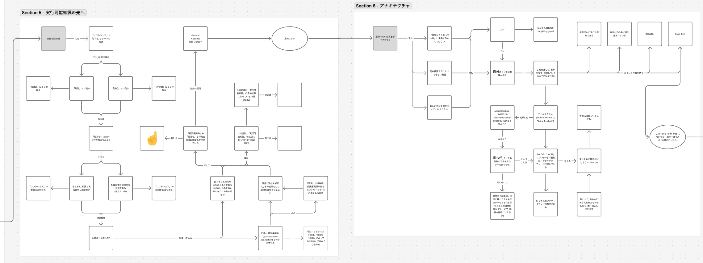

# requirement summary

conversensus は, 基本的には Diagram!, Visio, OmniGraffle, Figjam などに連なるダイアグラム・エディタです. ただし, それらと異なるのは, ヴィジュアルな図を書くのが目的ではなく, (数学的な意味での) グラフ構造を用いて, (広い意味での) テキストを表現する, 発話という行為そのものを実現するのが目的であることです.

数学的な構造としては基本的にラベル付き有向グラフであり, ノードは主に文や段落に対応しますが, 画像など他のリソースを許すものとします.

